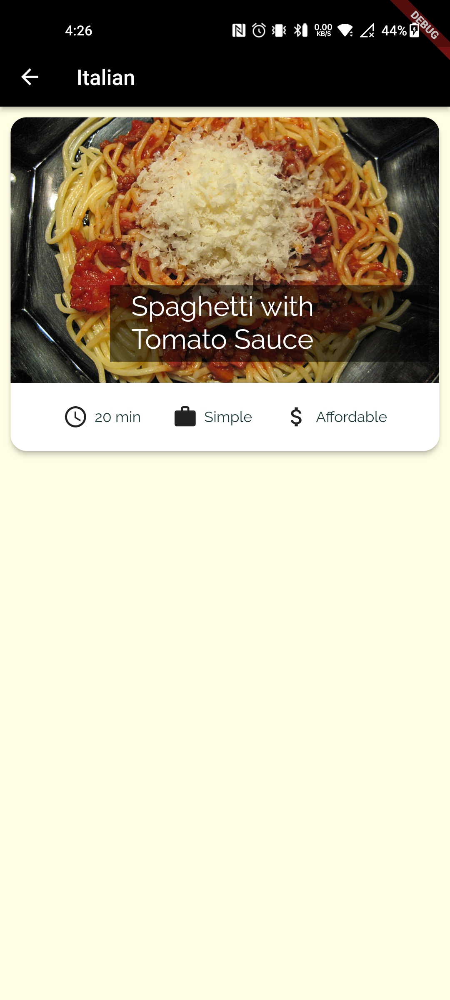
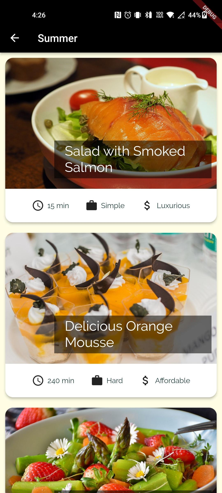
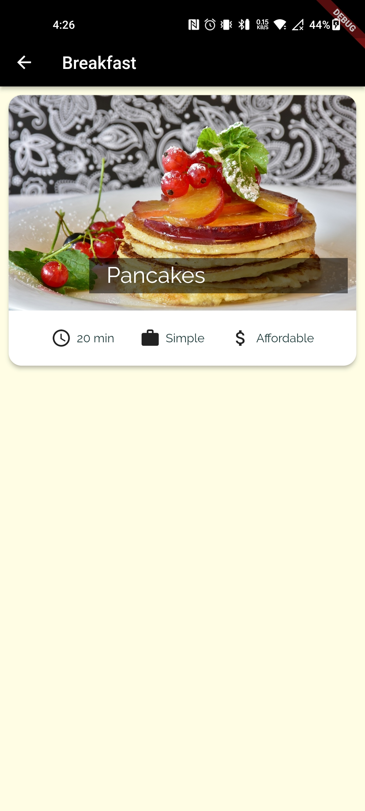
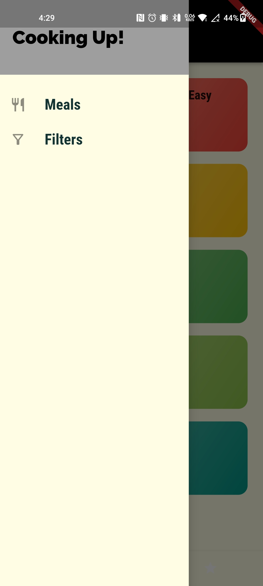
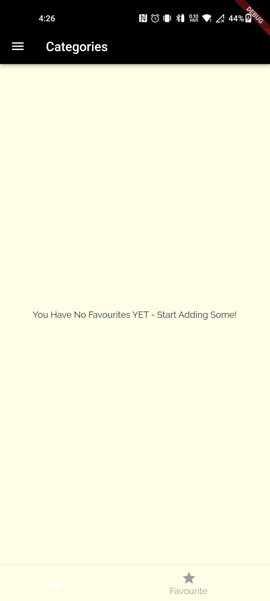
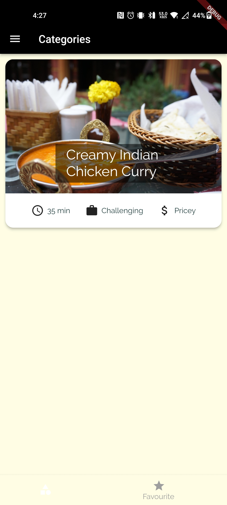
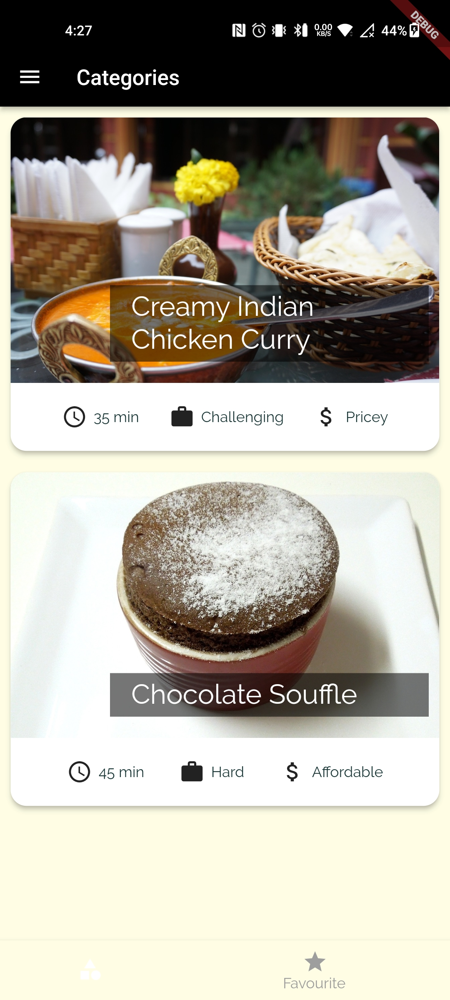
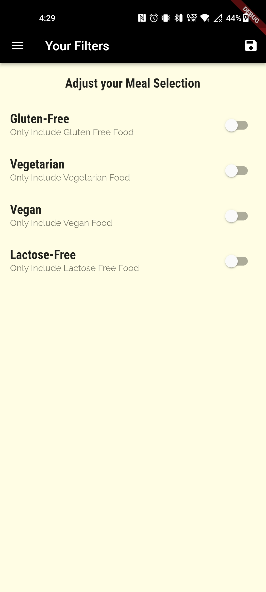

# Flutter Meal App

<div align="center">
  
</div>

Welcome to the Flutter Meal App repository! This is a delightful and feature-rich recipe application built with Flutter, designed to help users discover, create, and save their favorite recipes. Whether you're a cooking enthusiast or want to build a recipe sharing platform, this app provides a solid foundation to bring your culinary ideas to life.

## Features

- **Recipe browsing**: Explore a vast collection of recipes with beautiful images and detailed descriptions.
- **Search functionality**: Find recipes based on ingredients, cuisine, dietary preferences, and more.
- **Recipe creation**: Add your own recipes with step-by-step instructions and ingredient lists.
- **Favorite recipes**: Save your favorite recipes for quick access and future reference.
- **Recipe categories**: Browse recipes organized by categories like breakfast, lunch, dinner, desserts, etc.
- **Cooking timers**: Set cooking timers for each recipe step to help you stay on track.
- **Shopping list**: Create a shopping list with ingredients needed for your selected recipes.
- **User authentication**: Register and login securely to personalize your recipe collection.
- **Profile customization**: Customize your profile with a profile picture and personal information.
- **Social sharing**: Share your favorite recipes with friends and family on social media platforms.
- **Responsive design**: Enjoy a seamless user experience across various devices and screen sizes.

## App Demo

Demo video of the Flutter Meal App in action:

https://github.com/HiBorn4/flutter-meal-app/assets/94837419/eb1eb102-f2fd-4e22-a04c-4d82b397a34d

A demo video showcasing the Flutter Meal App's features.


## Screenshots

Here are some screenshots of the Flutter Meal App: 

<!-- Screenshot 1 -->
<div align="center">
  
  <p><em>The home screen displays featured recipes and categories for easy browsing.</em></p>
</div>

<!-- Screenshot 2 -->
<div align="center">
  
  <p><em>Detailed recipe information, including ingredients, instructions, and cooking timers.</em></p>
</div>

<!-- Screenshot 3 -->
<div align="center">
  
  <p><em>Categorized according to common needs</em></p>
</div>

<!-- Screenshot 4 -->
<div align="center">
  
  <p><em>Drawer to navigate between meals and recipies</em></p>
</div>

<!-- Screenshot 5 -->
<div align="center">
  
  <p><em>Users can create and manage their own recipes with step-by-step instructions.</em></p>
</div>

<!-- Screenshot 6 -->
<div align="center">
  
  <p><em>Multiple Recipies can be favouritized on your requirement</em></p>
</div>

<!-- Screenshot 7 -->
<div align="center">
  
  <p><em>Users can save or favourite a recipe so that they can use it afterwards</em></p>
</div>

<!-- Screenshot 8 -->
<div align="center">
  
  <p><em>Users can make filters in which we have four options and each recipe will be filtered</em></p>
</div>

## Getting Started

To get started with the Flutter Meal App, follow these steps:

1. Clone this repository to your local machine.
   ```shell
   git clone https://github.com/your-username/flutter-meal-app.git
   ```

2. Navigate to the project directory.
   ```shell
   cd flutter-meal-app
   ```

3. Install the necessary dependencies using Flutter's package manager, **pub**.
   ```shell
   flutter pub get
   ```

4. Run the app on a connected device or emulator.
   ```shell
   flutter run
   ```

## Contributing

Contributions to the Flutter Meal App are welcome and encouraged! If you find any bugs, have feature requests, or want to contribute in any other way, please open an issue or submit a pull request. We appreciate your help in making this app better.

## License

This project is licensed under the [MIT License](LICENSE). Feel free to use and modify the code to suit your needs.

## Acknowledgements

We would like to express our gratitude to the Flutter community for their continuous support and the developers of the libraries and packages used in this app.

If you have any questions or need further assistance, please feel free to contact me.

<div align="center">
  <a href="https://twitter.com/ShirkeAryan2234/" target="_blank">
    
  </a>
  <a href="https://www.linkedin.com/in/aryan-shirke/" target="_blank">
    
  </a>
</div>

Happy cooking and bon appétit!
